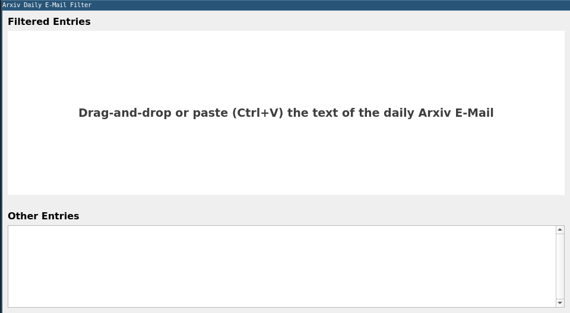
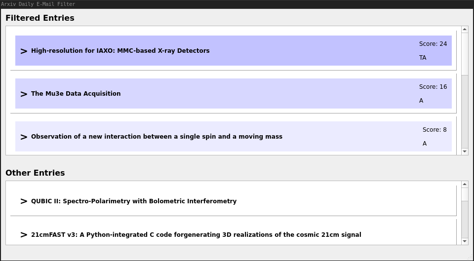
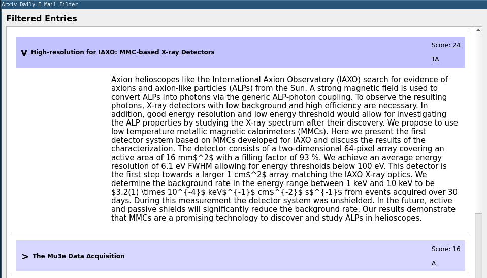

# arXiv Filter

## Content

- [Usage](#usage)
- [Config File](#config-File)
- [Dependencies](#dependencies)

This is a simple GUI program, which can be used to filter the daily arXiv email according to criterias defined in a custom config file.

The filtering / matching of individual arXiv entries is according to the following properties:

- Author name
- Keywords in the title
- Keywords in the abstract
- Collaboration name
- Category name

The filtering is done by attributing a score to each entry of the arXiv email. The score for each keyword can be specified in the config file (see bellow).

In the program window, paper which matched at least one keyword are shown in the list at the top and papers with no match in the list bellow. Papers with a higher score (for example matching multiple keywords) are shown in darker blue and at the top of the list.

This allows for quickly scanning the resulting filtered list and finding papers which are relevant to your interests / research.

## Usage
Run with

    # python3 -m arxiv_filter

or when installed via pip

    # arxiv-filter

The program looks for a config in 4 default locations:

1. `./arxiv_filter.yaml`
2. `~/.config/arxiv_filter.yaml`
3. `~/arxiv_filter.yaml`
4. `/etc/arxiv_filter.yaml`

The first config file which exists is used.

Alternatively, a custom config file can be passed to the program via the `-c PATH_TO_FILE` option.

Once the program has launched, an empty window is presented. Copy and past or drag and drop the text of an arXiv email into the window in order to start the filtering process.

Once the filtering is done, the two lists in the window are populated with entries. The top entries are highlighted in different shades of blue, according to the total score of an entry. In the image, the paper "High-resolution for IAXO: MMC-based X-ray Detectors" has obtained the highest score of 24 and is therefore listed at the top. The score for each entry is given.

The letters underneath the score indicate, which parts of the arXiv entry were matched:

- [**P**]eople: At least one author was matched.
- [**T**]itle: At least on keyword appears in the paper title.
- [**A**]bstract: At least one keyword appers in the abstract.
- [**C**]ategory: At least one category was matched.
- [**G**]roup: The collaboration matches.

In the above example, the first paper has a match of a keyword in the title and in the abstract.

By clicking on the title of the paper, the corresponding arXiv page is opened in a browser.

By clicking on the [**>**] symbol, the details of the paper is shown. The details include:

- Abstract: Always shown (if present)
- Collaboration: Always shown (if present)
- Authors: Only matched authors are shown
- Categories: Only matched categories are shown

If another arXiv email should be filtered, it can again be copy-pasted or drag and dropped onto the window. The list will then be updated with the information of the new email.

In general: Only information present int the arXiv email is processed and shown. The program does not retrieve any further data over the internet!

## Config File
The config file is structured in the YAML format. It allows for 4 different top level keys:

- _author_: For filtering according to name of the paper author(s)
- _keyword_: For filter according to keywords in the title and abstract of the paper.
- _category_: To filter according to the category name(s) of the paper.
- _collaboration_: To filter according to the name of the collaboration publishing the paper.

Under each key follows a list of keywords together with a weight.

And example config file is shown here:

    collaboration:
      cms: 5
      atlas: 10
      aegis: 5

    author:
      Higgs: 10
      Currie: 12
      Gianotti: 8

    keyword:
      sipm: 3
      mppc: 3
      silicon: 5
      gallium: 4
      arsenide: 4

The score of each keyword, author, collaboration etc. which is found in a given arXiv entry is added to the total score of this entry.

## Dependencies
- Python 3 Packages:
  - pyyaml
  - PyQt5
- Qt5

### Qt5
The Qt5 runtime needs to be installed on your system. Under standard linux distributions, this can usually easily be achieved via the package manager.

For example under Debian:

    apt install qt5-default

### Python Packages
The python packages can conveniently be installes via pip:

    pip3 install pyyaml PyQt5

#### PyQt5 Installation Issue
In case the installation of `PyQt5` via pip fails with an error similar to

    FileNotFoundError: [Errno 2] No such file or directory: '/tmp/pip-build-gzep4mr7/PyQt5/setup.py'

this is most likely due to an outdated version of pip. To fix this, upgrade your pip version with:

    pip3 install --upgrade pip

See also: https://stackoverflow.com/questions/59711301/install-pyqt5-5-14-1-on-linux/59797479#59797479
